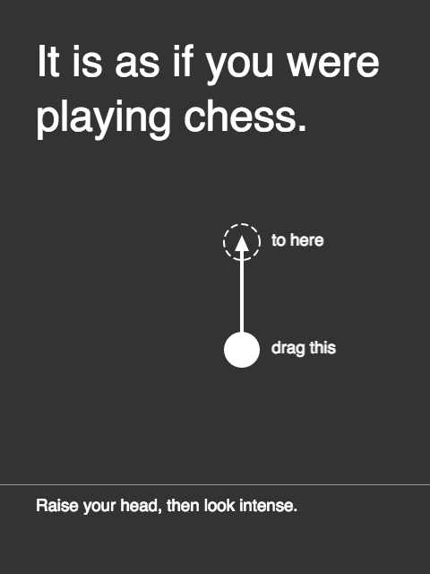
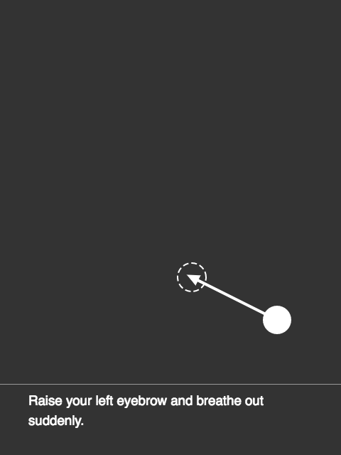
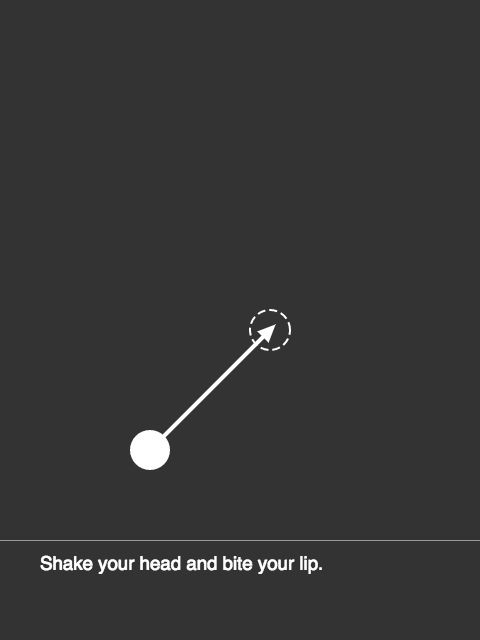

# *It is as if you were playing chess*

## Information
* Released: August, 2016
* Website: http://www.pippinbarr.com/games/
* Platforms: Browser
* Link: https://www.pippinbarr.com/it-is-as-if-you-were-playing-chess/
* Price: Free.

## Description
You've always wanted to be a chess master! But you aren't one! Are you!
Now you can at least look like one! Pretend you're playing chess! Make moves!
Act like you feel things! Smirk! Frown! Weep! Chess!

## History
"It is as if you were playing chess" is part of a larger project I'm calling
"It is as if you were playing a videogame". In both, the idea is to create
games that aren't game in themselves, per se, but allow/force/encourage the
player to act as if they're playing a game of some kind. The central image
for me in this is that of a player sitting at their computer or using their
mobile device while be observed by another person. To the observer it should
look as though the player is genuinely playing some kind of game. In this case
the idea is for them to look as though they are playing a game of chess,
making the appropriate motions (to drag chess pieces around), facial expressions,
eye movements, and so on. "It is as if you were playing chess" is thus an
interface designed to support you in pretending that you're playing a game of
chess.

Whether I will ever succeed in creating the more general "It is as if you were
playing a videogame" is less certain. "It is as if you were playing chess" is
valuable as it provides a simple way of testing out the idea of an interface
as a kind of game or game-referring experience. Chess, the game, provides
a well-known set of movements and emotional experiences that most players
should be able to "play along with" and thus "get" what the interface is doing.
Importantly, in the case of this game, there is actually an underlying game
of chess you are playing through as you follow the instructions, although
only the white side of the moves are actually stored in the game. I pursued
this angle, rather than completely random moves, to avoid the dissonance that
would be created by either impossible moves or incredibly unlikely moves, for
those who play enough chess to think through what is happening, much more
abstractly, on the screen.

## Features
* Being told what to do.
* Being told how to act.
* Being told where to look.
* Chess?

## Images

## Credits
* Pippin Barr: Everything
