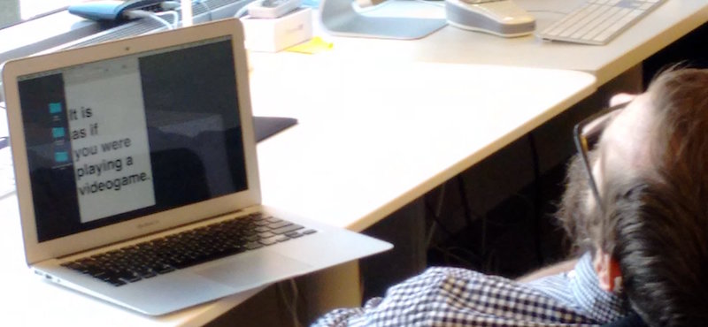

# Blog Posts

Here are public-facing blog posts I wrote while creating the game.

## New Project: It is as if you were playing a videogame (2016-06-16)

(Image credit: Dietrich Squinkifer)

I tried to relax for a couple of days after polishing off _Let&#8217;s Play: Ancient Greek Punishment: Limited Edition_ (coming next Tuesday!) but I felt weird and out of sorts. It&#8217;s probably a little bit depressing, but at present I find it stressful to just detune and not work on a game/thing. I&#8217;ve started reading Gertrude Stein&#8217;s &#8220;The Making of Americans&#8221; (so far so, so hard to read) and I thought I&#8217;d just spend a day doing that. But no. Just listless wandering around the house, checking Twitter too much, answering emails, etc.

So I decided to just plow on ahead and have been giving some thought to the next project on my list, which is called _It is as if you were playing a videogame_. (The photo above, by Squinky, would make a great &#8220;genesis image&#8221;, but sadly I&#8217;d already thought of the game name by then and had written it in a text document to see what it could look like on a mobile device. Still, I like the idea that my &#8220;design process&#8221; might just be &#8220;looking like I&#8217;m asleep&#8221;.)

The genesis of this particular game idea came on the metro looking at all the people with their phones and tablets, deeply engrossed, moving their fingers around on the screens mystically. Being perverse, I liked the idea that somehow they were all actually doing nothing at all, but rather following banal instructions to &#8220;interact&#8221; with their device in such a way as to look like they were playing a game (or whatever else they might appear to be doing).

So that&#8217;s the plan with _It is as if you were playing a videogame_ – it is to be a game that enables you to pretend (to others, perhaps even to yourself?) that you are playing a videogame. In some ways I also think of this as some sort of bizarre futuristic anxiety-support tool, allowing you to exist in a social space and appear to be busy at a socially sanctioned activity while in fact not really doing anything. (Why wouldn&#8217;t you just actually play a game? I don&#8217;t quite know, perhaps it would just be too stressful? Perhaps you don&#8217;t want to have real [game] emotions in public?)

This is all ties in with a longer-standing interest in making an abstract game that doesn&#8217;t rely on any narrative or world building properties for its graphics/text/aesthetics, but only has basic shapes and movements (e.g. &#8220;drag the circle to position (x,y)&#8221;). In fact the whole thing is more an exercise in interface design than game design because I want to explicitly avoid (as much as is possible in this weird situation) having it feel &#8220;like a game&#8221; in a more traditional sense. The affect of play/success/failure/tension etc. should all be as _fake_ as possible, I think.

Anyway, that&#8217;s where my thinking is for the moment. No doubt it will evolve/devolve as I move along with it. Be seeing you.

## New (old) Project: It is as if you were playing chess (2016-08-10)

Turning my mind back to the world of making the videogames. A while back I ~~[announced a new project](http://www.pippinbarr.com/2016/06/16/new-project-it-is-as-if-you-were-playing-a-videogame/)~~ called _It is as if you are playing a videogame_. I spent a bit of time thinking about it before I made _Independence, Missouri_ and one of the big struggles was how to think of it as a single, unified game. Bits and pieces of different ideas kept shuffling around as I tried to fix it in place &#8211; notably the question of how you generically represent &#8220;videogame&#8221; in abstract mechanics.

So, as a way to tunnel in, I thought I&#8217;d make one of the more specific versions I&#8217;ve been thinking about: chess. Thus, _It is as if you were playing chess_ has been born and is underway. It&#8217;s much easier, because the overriding idea of &#8220;pretend you&#8217;re playing a game&#8221; is much more straightforwardly expressed with a known game with know inputs and outcomes like this. It lets me get at a few of the key ideas without getting lost in side-tracks.

Those key ideas as I see them right now revolve around the idea of &#8220;performing&#8221; a game without actually playing it. So you look like you&#8217;re playing chess, but actually you&#8217;re just performing quite abstract movements and expressions with your device. The game explicitly tells you what movements to make with your hands (using the mouse or on a touch screen) and also instructs you on how you should appear emotionally. In this way, all of &#8220;chess&#8221; is there as far as an observer might be concerned, but of course you&#8217;re not actually playing chess at all.

Making it be chess specifically also helps on the &#8220;visualisation&#8221; side of the game, which has been a tricky element for the design of the more abstract &#8220;videogame&#8221;, version. If you&#8217;re performing this abstract inputs, you&#8217;ll connect them to the idea of a &#8220;real&#8221; underlying game. If the game is telling you to make gestures with your mouse, clicking and dragging shapes around, you&#8217;ll probably associate that to the idea you&#8217;re moving pieces in an invisible &#8220;real game of chess&#8221;. As such, a decent chess player would be able to tell that the game wasn&#8217;t really reflective if I made the movements completely arbitrary. With the chess version, I _can_ insert an underlying game of chess that you play through &#8211; you don&#8217;t decide the moves of course, you just make them when instructed, but they _are from a legal game of chess_, so you don&#8217;t have that kind of dissonance that could be created.

That&#8217;s where I&#8217;m at with it. Hoping this will be pretty straightforward to develop and release quite soon. I have a bunch of basic interface stuff implemented and mostly need to insert the real chess game and think about the &#8220;emotion instructor&#8221; part of it all.

Hope you&#8217;re well, say hi to the kids for me.

## Invisible Realism (2016-08-17)

(Excuse me while I push through the pain and write a quick post about something or other.)

While I was writing the press kit for _It is as if you were playing chess_ (out Friday!) I reminded myself of the fact that the game features a real underlying game of chess. The rationale for that is that if you&#8217;re making these abstract &#8220;chess moves&#8221; with the interface, even someone not very attuned to chess might be able to notice if the moves were essentially generated at random. Like, &#8220;hang on, there isn&#8217;t even a piece on that square right now&#8221; or &#8220;there is literally no piece that can move like that&#8221;. Rather than write sufficient code to generate plausible moves, I just imported the move of pre-existing (and famous, as it happens) chess games. Because otherwise, even if you make sure the game shows _legal_ moves it might still show _stupid_ moves, and nobody wants to play _It is as if you were playing chess and were not very good at it at all_. (Although, having written that title, I&#8217;m like&#8230;)

Anyway, the game contains the moves (for white) of three classic chess matches, such that when you make the abstract moves there&#8217;s a sense in which you&#8217;re &#8220;really playing chess&#8221; I suppose, but also not, since nowhere in the game are the moves for black, for example. So you&#8217;re not really. But there _is_ a kind of ground realism for the moves you make under there. And I like that idea that even in a deeply meaningless-looking interface there can still be seriousness below the surface. In fact it also refers back to _[Best Chess](http://www.pippinbarr.com/2015/07/30/best-chess/)_ for me – in that game it looked to a large extent like nothing at all was happening, but in fact under the hood the game was literally working on _solving chess_, not just pretending to. That kind of authenticity is, I think, oddly powerful. Perhaps all the more so in this world of online games and especially JavaScript where, if people want to, they can pretty easily _check_ what&#8217;s going on in the innards of a game they&#8217;re playing. (Unless I went out of my way to obfuscate it, which I don&#8217;t. See also: _[Leaderboarder](http://www.pippinbarr.com/2014/04/25/leaderboarder/)_ for hilarity involving players and code.)

Do I have a point? I&#8217;m not 100% sure I do, but I do like internal authenticity and &#8220;responsibility&#8221; in games, games that don&#8217;t just pretend something is happen, but &#8220;do the work&#8221; beneath the surface, even if it&#8217;s invisible?

Anyway, don&#8217;t mind me.

## It is as if you were playing chess: Is it a game? (2016-09-01)

While working on the course I teach on game making this semester, I got to thinking about the old, (bitter?) chestnut of game definitions, and I found myself wondering whether a pseudo-game such as _It is as if you were playing chess_ meets the definition of a game or not. So, with the help of the excellent Jesper Juul, who wrote a [nicely modular and clear definition of &#8216;game&#8217;](https://www.jesperjuul.net/text/gameplayerworld/), let&#8217;s see&#8230;

_1. Fixed rules._

Seems legit. We definitely have rules, even visible in the above screenshot from the game – the rules are that you drag circles into destinations.

_2. Variable and quantifiable outcomes._

Uh-oh? So this gets at the reason I thought this might be an interesting exercise, because _It is as if you were playing chess_ is a &#8216;game&#8217; that _contains_ a game in some sense. Although the player isn&#8217;t specifically aware of it, the chess game she is going through the motions of (or &#8216;performing&#8217;) has a quantifiable outcome (a draw, or black or white wins). Furthermore, it&#8217;s variable because the chess game you&#8217;re playing through is randomised (not that you influence this outcome as a player).

Even furthermore, if we look at the meta-game of performance, we could claim there are variable outcomes, because the game always ends on an implied emotional tone, randomly generated by the game&#8217;s grammar. (Although the emotional tone implied at the end does not necessarily match the actual result of the game being performed, which is unknown to the game in the first place.)

_3. Valorisation of the outcome.

_ Following on from the above, it&#8217;s clear that the outcomes are valorised as well to the extent that in the underlying chess game it&#8217;s desirable to win (presumably), and to the extent that the final emotional tone implies a valence above the ending of the game, even if it&#8217;s maybe up to the interpretation of the player whether that implication seems to be &#8220;good&#8221; or &#8220;bad&#8221;.

_4. Player effort.

_ This one is a problem I think. The obvious actions you take in _It is as if you were playing chess_ are trivial, just dragging a circle to a destination. On the other hand, the performative element of the game, striking the appropriate poses with your body and expressions with your face, isn&#8217;t trivial at all and could be said to involve player effort. In a cute way, we might say that the player&#8217;s performance even &#8220;influences the outcome of the game&#8221;, because it will shape the player&#8217;s affect and emotional connection to the game&#8217;s imagined end over time. On the other hand, Juul&#8217;s definition doesn&#8217;t seem to strictly _require_ having an influence over the outcome (e.g. games of chance).

_5. Attachment of the player to the outcome.

_ This seems entirely possible to claim for the game. Even when pretending to play chess, we might imagine that one wants to pretend to win? Or perhaps we could even become attached to other performative outcomes, like appearing to lose, or appearing to go through a great struggle during play. Such outcomes are admittedly mostly defined by the player, but it&#8217;s in collaboration with the emotional and spatial cues provided by the game.

_6. Negotiable consequences.

_ It seems fairly clear that _It is as if you were playing chess_ could be &#8220;_optionally_ assigned real-life consequences&#8221; &#8211; its actions/moves are indeed &#8220;predominantly harmless&#8221;, as all you do is move shapes around on a screen and do some acting (unless you perhaps find the acting itself traumatic I suppose). So you could negotiate any kind of consequences for the game you might want – you might agree to act as if your imagined result of the game affects your whole day afterwards, for example, or you might bet money on the game&#8217;s outcome, deciding whether you won or lost at the end!

So having gone through with that exercise, it seems like _It is as if you were playing chess_ is a game. So there?

**Update:** [Jesper Juul says it&#8217;s not a game](https://twitter.com/jesperjuul/status/771626951446401025), my world is in ruins around me. But I&#8217;ve always kind of liked post-apocalyptic settings, so it&#8217;s okay?
